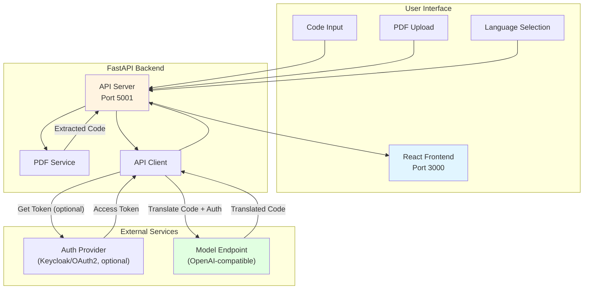

## Code Translation

A full-stack code translation application that converts code between programming languages using AI.
The system integrates a FastAPI backend that calls an OpenAI-compatible inference endpoint (defaulting to `meta-llama/Llama-3.1-8B-Instruct`), alongside a modern React + Vite + Tailwind CSS frontend for an intuitive translation experience.

## Table of Contents

- [Project Overview](#project-overview)
- [Features](#features)
- [Architecture](#architecture)
- [Prerequisites](#prerequisites)
- [Quick Start Deployment](#quick-start-deployment)
- [User Interface](#user-interface)
- [Troubleshooting](#troubleshooting)

---

## Project Overview

The **Code Translation** application demonstrates how large language models can be used to translate code between different programming languages. It accepts source code in one language, processes it through a configurable OpenAI-compatible model endpoint, and returns translated code in the target language. This project integrates seamlessly with cloud-hosted APIs or local model endpoints, offering flexibility for research, enterprise, or educational use. The default model is `meta-llama/Llama-3.1-8B-Instruct`, but you can point it to other models such as CodeLlama-34b.

---

## Features

**Backend**

- Code translation between 6 languages (Java, C, C++, Python, Rust, Go)
- PDF code extraction with pattern recognition
- Configurable OpenAI-compatible inference endpoint (default: `meta-llama/Llama-3.1-8B-Instruct`)
- Authentication priority: client credentials token at `${BASE_URL}/token` (if `KEYCLOAK_CLIENT_ID`/`KEYCLOAK_CLIENT_SECRET` set) → `INFERENCE_API_KEY` → open/no-auth mode (endpoint must accept unauthenticated requests)
- Comprehensive error handling and logging
- File validation and size limits
- CORS enabled for web integration
- Health check endpoints
- Modular architecture (config + models + services)

**Frontend**

- Side-by-side code comparison interface
- Language selection dropdowns (6 languages)
- PDF file upload with drag-and-drop support
- Real-time character counter with limits
- Modern, responsive design with Tailwind CSS
- Built with Vite for fast development
- Live status updates
- Copy to clipboard functionality
- Mobile-friendly

---

## Architecture

Below is the architecture as it consists of a server that waits for code input or PDF uploads. Once code is provided, the server calls the configured OpenAI-compatible model to translate the code to the target language.



This application is built with enterprise inference capabilities using optional Keycloak authentication and any OpenAI-compatible inference endpoint (defaulting to `meta-llama/Llama-3.1-8B-Instruct`).

**Service Components:**

1. **React Web UI (Port 3000)** -  Provides side-by-side code comparison interface with language selection, PDF upload, and real-time translation results

2. **FastAPI Backend (Port 5001)** -  Handles code validation, PDF extraction, optional Keycloak authentication or API-key auth, and orchestrates code translation through your configured model endpoint

**Typical Flow:**

1. User enters code or uploads a PDF through the web UI.
2. The backend validates the input and extracts code if needed.
3. The backend authenticates via client credentials at `${BASE_URL}/token` (if `KEYCLOAK_CLIENT_ID`/`KEYCLOAK_CLIENT_SECRET` are set) or uses `INFERENCE_API_KEY`/open mode, then calls the normalized OpenAI-compatible endpoint at `${BASE_URL}/v1/chat/completions`.
4. The model translates the code to the target language.
5. The translated code is returned and displayed to the user.
6. User can copy the translated code with one click.

---

## Prerequisites

### System Requirements

Before you begin, ensure you have the following installed:

- **Docker and Docker Compose**
- **Access to an OpenAI-compatible inference endpoint** (with Keycloak token or API key if required)

### Verify Docker Installation

```bash
# Check Docker version
docker --version

# Check Docker Compose version
docker compose version

# Verify Docker is running
docker ps
```
---

## Quick Start Deployment

### Clone the Repository

```bash
git clone https://github.com/VPC-Repo/Dell_Inference_Blueprints.git
cd Dell_Inference_Blueprints/code-translation
```

### Set up the Environment

This application requires an `.env` file in the root directory for proper configuration. A template is provided—copy it and fill in your values:

```bash
cp .env.example .env
```

Key points for configuration:
- `BASE_URL` is required and should point to the root of your OpenAI-compatible endpoint (the backend normalizes it to `${BASE_URL}/v1/chat/completions`, stripping any trailing `/v1` or `/chat/completions` you might paste in).
- Choose one auth path: set `INFERENCE_API_KEY`, or set `KEYCLOAK_CLIENT_ID`/`KEYCLOAK_CLIENT_SECRET` to request a token from `${BASE_URL}/token`. Leaving both blank uses open/no-auth mode (the endpoint must allow unauthenticated calls). `KEYCLOAK_REALM` is kept for compatibility but is not used in the current token request.
- Other settings already have defaults (`INFERENCE_MODEL_NAME`, `LLM_TEMPERATURE`, `LLM_MAX_TOKENS`, `MAX_CODE_LENGTH`, `MAX_FILE_SIZE`, `CORS_ALLOW_ORIGINS`), so override them only if you need different values. `CORS_ALLOW_ORIGINS` defaults to `*` when not set.

Example `.env` content:

```bash
BASE_URL=https://api.example.com
INFERENCE_API_KEY=your_api_key            # or leave blank if using client credentials/open mode
KEYCLOAK_CLIENT_ID=api                    # optional
KEYCLOAK_CLIENT_SECRET=your_client_secret # optional
KEYCLOAK_REALM=master

INFERENCE_MODEL_NAME=meta-llama/Llama-3.1-8B-Instruct
LLM_TEMPERATURE=0.2
LLM_MAX_TOKENS=4096

MAX_CODE_LENGTH=10000
MAX_FILE_SIZE=10485760

# Optional: override default "*" if you want to restrict origins
CORS_ALLOW_ORIGINS=http://localhost:5173,http://localhost:3000
```

**Note**: The docker-compose.yaml file automatically loads environment variables from `.env` for the backend service.

### Running the Application

Start both API and UI services together with Docker Compose:

```bash
# From the repository root (code-translation)
docker compose up --build

# Or run in detached mode (background)
docker compose up -d --build
```

The API will be available at: `http://localhost:5001`  
The UI will be available at: `http://localhost:3000`

**View logs**:

```bash
# All services
docker compose logs -f

# Backend only
docker compose logs -f backend

# Frontend only
docker compose logs -f frontend
```

**Verify the services are running**:

```bash
# Check API health
curl http://localhost:5001/health

# Check if containers are running
docker compose ps
```

## User Interface

**Using the Application**

Make sure you are at the localhost:3000 url

You will be directed to the main page which has each feature


The interface provides:

Translate code:

- Select source language from dropdown (Java, C, C++, Python, Rust, Go)
- Select target language from dropdown
- Enter or paste your code in the left textarea
- Click "Translate Code" button
- View translated code in the right textarea
- Click "Copy" to copy the result

Upload a PDF:

- Scroll to the "Alternative: Upload PDF" section
- Drag and drop a PDF file, or
- Click "browse" to select a file
- Wait for code extraction to complete
- Extracted code appears in the source code box

Translation requests are limited to 10,000 characters and PDF uploads are limited to 10 MB (enforced by both the UI and backend).

**UI Configuration**

When running with Docker Compose, the UI automatically connects to the backend API. The frontend is available at `http://localhost:3000` and the API at `http://localhost:5001`.


For production deployments, you may want to configure a reverse proxy or update the API URL in the frontend configuration.

### Stopping the Application


```bash
docker compose down
```

---

## Troubleshooting

For comprehensive troubleshooting guidance, common issues, and solutions, refer to:

[Troubleshooting Guide - TROUBLESHOOTING.md](./TROUBLESHOOTING.md)
