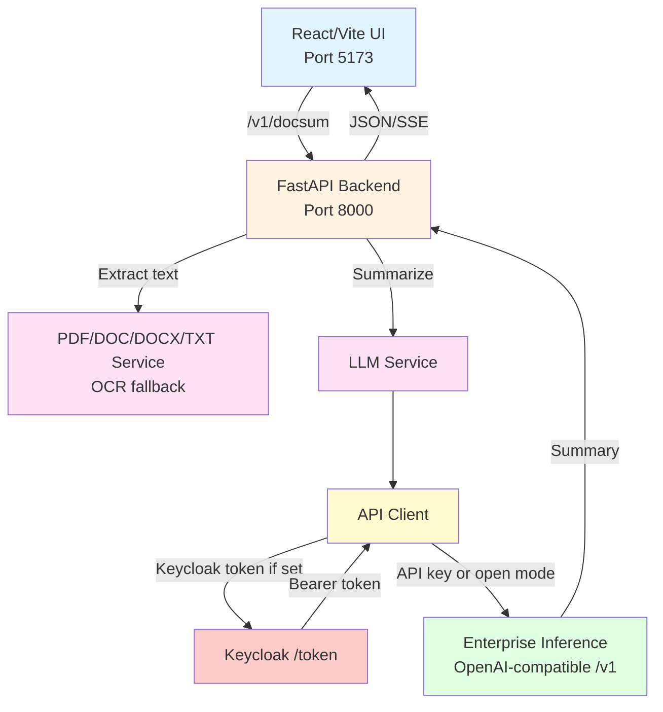

## Document Summarization

Full-stack document summarization with a FastAPI backend and React + Vite frontend. Text or documents (PDF/DOC/DOCX/TXT) are extracted server-side and summarized through an OpenAI-compatible enterprise inference endpoint with optional Keycloak token, API key, or open mode.

## Table of Contents

- [Project Overview](#project-overview)
- [Features](#features)
- [Architecture](#architecture)
- [Configuration](#configuration)
- [Run with Docker](#run-with-docker)
- [Run Locally](#run-locally)
- [API](#api)
- [User Interface](#user-interface)
- [Troubleshooting](#troubleshooting)

---

## Project Overview

The application accepts pasted text or uploaded documents and returns a concise summary. PDFs attempt text extraction first and fall back to OCR when needed. Summaries are generated via an OpenAI-compatible endpoint at `BASE_URL`, with authentication negotiated automatically (Keycloak client credentials → `INFERENCE_API_KEY` → open mode).

---

## Features

**Backend**

- One summarization endpoint for text or common document types; PDFs fall back to OCR if needed.
- Chooses the right model automatically and sends requests to your configured inference endpoint.
- Works with secure token, API key, or open mode (you pick); results can stream live or return in one response.
- Designed to stay stable and observable with health checks and logging.

**Frontend**

- Clean two-tab flow: paste text or upload a file, with drag-and-drop and clear format/size hints.
- Connects to the backend endpoint you set, including when running through Docker.
- Responsive layout with instant toast feedback and a dedicated summary viewer.

**User benefits**

- Paste text or drag-and-drop documents with clear format guidance.
- Optional streaming shows summaries as they are generated.
- Responsive UI on desktop and mobile with instant success/error toasts.

---

## Architecture



---

## Configuration

### Backend environment (`backend/.env`)
Copy the template and edit values:
```bash
cp backend/.env.example backend/.env
```
Key settings:
- `BASE_URL` (required): Base URL of the enterprise inference gateway (example: `https://api.example.com`).
- Auth options (priority):
  - Keycloak: `KEYCLOAK_CLIENT_ID`, `KEYCLOAK_CLIENT_SECRET` (token requested at `${BASE_URL}/token`).
  - API key: `INFERENCE_API_KEY` (OpenAI-style key).
  - Open mode: no credentials; a placeholder key is used but `BASE_URL` is still required.
- Models: `SELECTED_MODEL` (if set) → `INFERENCE_MODEL_NAME` (default `meta-llama/Llama-3.1-8B-Instruct`) → `INFERENCE_MODEL_ENDPOINT`.
- LLM tuning: `LLM_TEMPERATURE`, `LLM_MAX_TOKENS`.
- Processing limits: `MAX_PDF_PAGES` (default 100-page cap). `MAX_FILE_SIZE`/`MAX_PDF_SIZE` are available for future validation; Docker nginx currently allows up to 500MB uploads.
- Service: `SERVICE_PORT` (default 8000), `LOG_LEVEL`, `CORS_ORIGINS`.

### Frontend environment (`frontend/.env.local`)
Set when running outside Docker:
```bash
VITE_BACKEND_ENDPOINT=http://localhost:8000
```
Leave empty when using Docker Compose; nginx forwards `/v1/*` to the backend container.

### Local system dependencies (when not using Docker)
PDF OCR requires system packages:
- macOS (Homebrew): `brew install tesseract poppler`
- Debian/Ubuntu: `sudo apt-get install tesseract-ocr tesseract-ocr-eng poppler-utils`

---

## Run with Docker

```bash
git clone https://github.com/VPC-Repo/Dell_Inference_Blueprints.git
cd Dell_Inference_Blueprints/doc-summarization

cp backend/.env.example backend/.env   # then edit values
docker compose up --build              # add -d to run detached
```

- Backend API: `http://localhost:8000`
- API docs: `http://localhost:8000/docs`
- Frontend: `http://localhost:5173`
- Logs: `docker compose logs -f [backend|frontend]`
- Stop: `docker compose down`

---

## Run Locally

Backend:
```bash
cd backend
python3 -m venv .venv
source .venv/bin/activate
pip install -r requirements.txt
cp .env.example .env   # configure BASE_URL and auth
uvicorn server:app --host 0.0.0.0 --port 8000 --reload
```

Frontend:
```bash
cd frontend
npm install
echo "VITE_BACKEND_ENDPOINT=http://localhost:8000" > .env.local
npm run dev -- --host --port 5173
```

---

## API

- `GET /health` – Service status (includes `llm_provider` only when auth is configured).
- `POST /v1/docsum` – Form-data fields:
  - `type`: `text` for raw text; any value when uploading a file.
  - `messages`: text content (required when `type=text`).
  - `files`: PDF/DOC/DOCX/TXT upload (optional).
  - `max_tokens`: summary length (default 1024).
  - `language`, `summary_type`: reserved fields (passed through to the backend).
  - `stream`: `true` for SSE streaming; otherwise returns JSON.

Examples:
```bash
# Text
curl -X POST http://localhost:8000/v1/docsum \
  -F "type=text" \
  -F "messages=Paste your text here"

# PDF/DOC/DOCX
curl -X POST http://localhost:8000/v1/docsum \
  -F "type=file" \
  -F "files=@/path/to/document.pdf" \
  -F "max_tokens=1024"
```

---

## User Interface

Open `http://localhost:5173` and use the **Generate Summary** page to paste text or upload a PDF/DOC/DOCX. The two-tab layout keeps text and file inputs simple, drag-and-drop is supported, and toast alerts confirm success or errors. Summaries appear in the right-hand panel.


---

## Troubleshooting

See `TROUBLESHOOTING.md` for common fixes.
