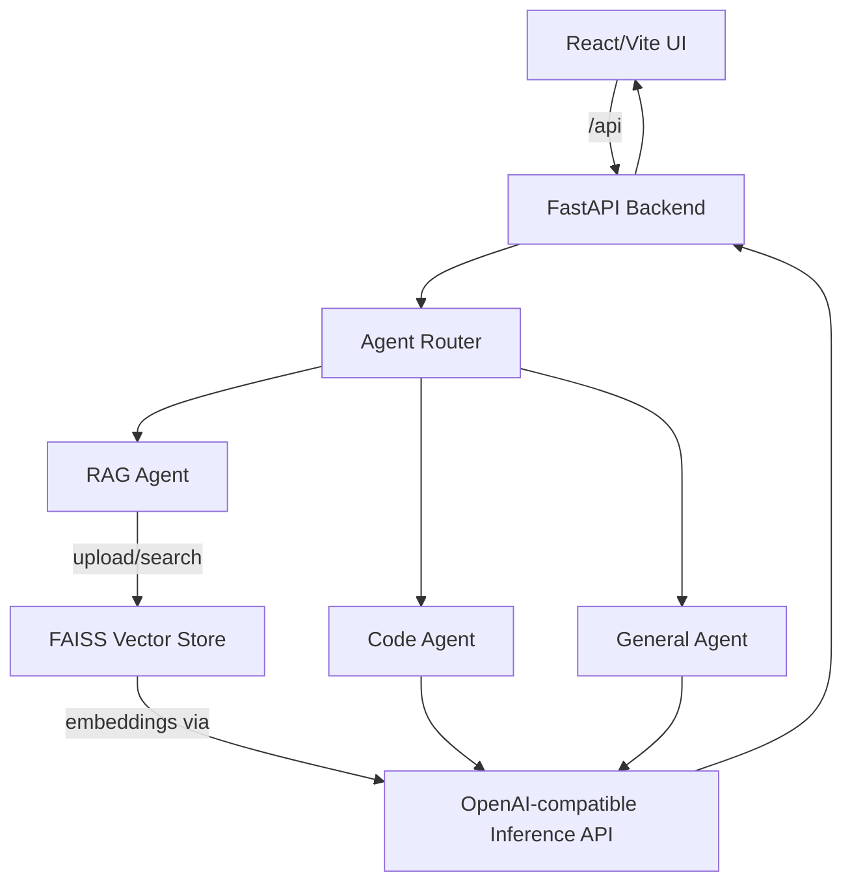
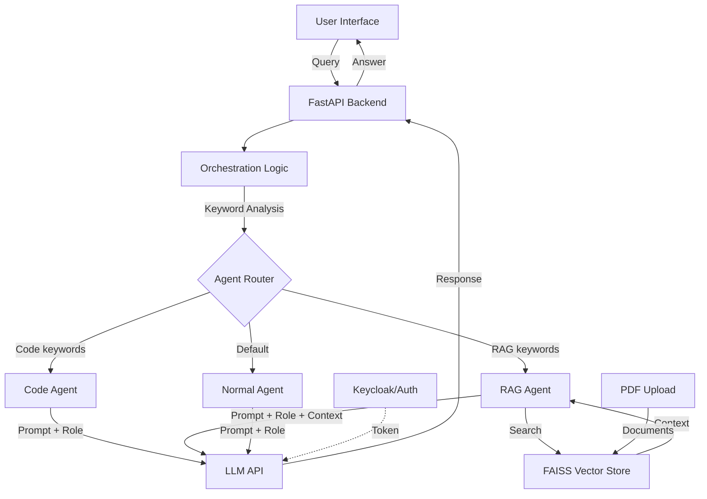

## Multi-Agent Q&A Application

Multi-agent Q&A system with a FastAPI backend and React UI. User queries are inspected for keywords and routed to specialized agents (code, RAG, or general), then answered through an OpenAI-compatible inference endpoint (Keycloak client credentials or API key).

## Table of Contents

- [Project Overview](#project-overview)
- [Features](#features)
- [Architecture](#architecture)
- [Prerequisites](#prerequisites)
- [Setup](#setup)
- [Quick Start Deployment](#quick-start-deployment)
- [Run with Docker Compose](#run-with-docker-compose)
- [Local Development](#local-development)
- [Using the Application](#using-the-application)
- [User Interface](#user-interface)
- [API Endpoints](#api-endpoints)
- [Troubleshooting](#troubleshooting)

---
## Project Overview

The multiagent-qna project is a Question & Answer application built on a multi-agent architecture. A FastAPI backend in `api/` receives a user's query, uses simple keyword detection to choose the most suitable specialized agent (code, retrieval, or general), and sends a prompt to an OpenAI-style inference API. A Vite/React frontend in `ui/` provides a chat interface, settings management, PDF upload for retrieval, and activity logs.

---

## Features

- **Multi-agent architecture**: Orchestration layer that routes queries to specialized agents.
- **Specialized agents**:
  - **Code Agent**: Handles code-related questions and programming queries.
  - **RAG Agent**: Retrieves and answers questions from documents.
  - **Normal Agent**: Handles general questions and conversations.
- **PDF ingestion + retrieval**: Upload PDFs, chunk text, embed with the configured inference API, and store vectors in `api/rag_index` (FAISS).
- **Modern UI**: ChatGPT-like interface with settings management and logs.
- **Enterprise integration**: Uses Keycloak client credentials or an inference API key for OpenAI-compatible endpoints.
- **Configurable**: Configure agent roles, goals, backstories, and verbosity via UI or `/config`.
- **Activity logs**: Recent agent activity available via `/logs` and the UI Logs panel.

---

## Architecture

High-level services:


Routing and retrieval flow:


The application consists of:
1. **Orchestration agent**: Analyzes user queries and delegates to specialized agents.
2. **Specialized agents**: Each handles a specific domain (code, RAG, general).
3. **API layer**: FastAPI backend with enterprise-inference/OpenAI-compatible integration.
4. **UI**: React-based chat interface with settings and logs.

Service components:
1. **React Web UI (port 3000)** - Chat interface with settings management.
2. **FastAPI Backend (port 5001)** - Orchestrates multi-agent system, performs keyword routing, and manages FAISS vector store for document retrieval.

Typical flow:
1. User submits a query through the chat interface.
2. FastAPI receives the query and passes it to the orchestration logic.
3. The orchestration logic analyzes the query using keyword detection to determine intent.
4. The agent router delegates the query to the appropriate specialized agent:
   - **Code-related queries** (keywords: code, function, debug, etc.) -> Code Agent
   - **Document-based queries** (keywords: document, PDF, search, etc.) -> RAG Agent
   - **General queries** -> Normal Agent
5. If RAG Agent is selected:
   - Searches the FAISS vector store for relevant document context.
   - Retrieves matching chunks to augment the prompt.
6. The selected agent constructs a specialized prompt with its role, goal, and context.
7. The system authenticates using Keycloak client credentials if configured, or uses the provided inference API key.
8. The agent calls the inference API with the token/key and specialized prompt.
9. The model (for example `meta-llama/Llama-3.1-8B-Instruct`) generates a response tailored to the agent's expertise.
10. The response returns to the UI with agent attribution showing which specialist handled the query.

---

## Prerequisites

### System requirements
- Docker and Docker Compose
- Access to an OpenAI-compatible inference endpoint (Keycloak client credentials or API key)

### Verify Docker installation
```bash
docker --version
docker compose version
docker ps
```

---

## Setup

1. **Clone the repository**
   ```bash
   git clone https://github.com/VPC-Repo/Dell_Inference_Blueprints.git
   cd Dell_Inference_Blueprints/multiagent-qna
   ```

2. **Create the API environment file**
   ```bash
   cp api/env.example api/.env
   ```
   Update `api/.env` with your values:
   ```env
   BASE_URL=https://your-inference-host
   KEYCLOAK_REALM=master
   KEYCLOAK_CLIENT_ID=api
   KEYCLOAK_CLIENT_SECRET=your_secret_here
   # Or use a direct key instead of Keycloak:
   # INFERENCE_API_KEY=your_api_key
   EMBEDDING_MODEL_ENDPOINT=bge-base-en-v1.5
   INFERENCE_MODEL_ENDPOINT=Llama-3.1-8B-Instruct
   EMBEDDING_MODEL_NAME=bge-base-en-v1.5
   INFERENCE_MODEL_NAME=meta-llama/Llama-3.1-8B-Instruct
   ```
   Manual creation alternative:
   ```bash
   mkdir -p api
   cat > api/.env << 'EOF'
   BASE_URL=https://your-inference-host
   KEYCLOAK_REALM=master
   KEYCLOAK_CLIENT_ID=api
   KEYCLOAK_CLIENT_SECRET=your_secret_here
   EMBEDDING_MODEL_ENDPOINT=bge-base-en-v1.5
   INFERENCE_MODEL_ENDPOINT=Llama-3.1-8B-Instruct
   EMBEDDING_MODEL_NAME=bge-base-en-v1.5
   INFERENCE_MODEL_NAME=meta-llama/Llama-3.1-8B-Instruct
   # INFERENCE_API_KEY=your_api_key
   EOF
   ```
   `config.py` enforces that at least one of `KEYCLOAK_CLIENT_SECRET` or `INFERENCE_API_KEY` (or `OPENAI_API_KEY`, though the API client reads `INFERENCE_API_KEY`) is set.

---

## Quick Start Deployment

### Clone the repository
```bash
git clone https://github.com/VPC-Repo/Dell_Inference_Blueprints.git
cd Dell_Inference_Blueprints/multiagent-qna
```

### Set up the environment
Create `api/.env` as shown above (copy `api/env.example` or create it manually).

### Running the application
Start both API and UI services together with Docker Compose:
```bash
docker compose up --build
# Or run in detached mode (background)
docker compose up -d --build
```

The API will be available at: `http://localhost:5001`  
The UI will be available at: `http://localhost:3000` (the API lives on 5001; the UI only serves on 3000)

View logs:
```bash
docker compose logs -f          # all services
docker compose logs -f backend  # backend only
docker compose logs -f frontend # frontend only
```

Verify the services:
```bash
curl http://localhost:5001/health
docker compose ps
```

---

## Run with Docker Compose

From the repository root:
```bash
docker compose up --build
# or detached
docker compose up -d --build
```

- Backend: `http://localhost:5001`
- Frontend: `http://localhost:3000`

Logs and status:
```bash
docker compose logs -f
docker compose logs -f backend
docker compose logs -f frontend
docker compose ps
curl http://localhost:5001/health
```

Stop the stack:
```bash
docker compose down
```

---

## Local Development

Backend:
```bash
cd api
python -m venv venv
source venv/bin/activate  # Windows: venv\Scripts\activate
pip install -r requirements.txt
cp env.example .env  # if you haven't created one
uvicorn server:app --reload --host 0.0.0.0 --port 5001
```

Frontend:
```bash
cd ui
npm install
VITE_API_URL=http://localhost:5001 npm run dev -- --host --port 3000
```
`VITE_API_URL` points the UI directly at the locally running backend; when running in Docker, the Vite proxy uses the `backend` service name instead.

---

## Using the Application

- **Chat:** Ask coding, document, or general questions. The response badge shows which agent handled it.
- **Document ingestion:** Use the "Upload PDF" button in the chat header to index a PDF. The FAISS index lives in `api/rag_index`; the chat UI shows how many documents are indexed.
- **Settings:** Customize each agent's role, goal, backstory, max iterations, and verbosity on the Settings page (`/config` API).
- **Logs:** Open the Logs panel from the header to view recent agent activity (`/logs` API).
- **Health check:** `curl http://localhost:5001/health`

---

## User Interface

Make sure you are at `http://localhost:3000`. You will land on the main page with each feature.


### Chat Interface
1. Navigate to the chat interface.
2. Type your question in the input box.
3. The orchestration agent analyzes your query and routes it to the appropriate specialized agent.
4. View the response with agent attribution.

### Settings Page
Configure agents:
- **Orchestration Agent**: Role, goal, and backstory.
- **Code Agent**: Code-specific configuration.
- **RAG Agent**: Document retrieval settings.
- **Normal Agent**: General conversation settings.

UI configuration:
When running with Docker Compose, the UI automatically connects to the backend API. The frontend is available at `http://localhost:3000` and the API at `http://localhost:5001`. For production deployments, configure a reverse proxy or update the API URL in the frontend configuration.

### Stopping the application
```bash
docker compose down
```

---

## API Endpoints

- `GET /health` - service status and whether auth is configured
- `POST /chat` - `{ "message": "...", "agent_config": { ... } }` -> `{ "response": "...", "agent": "code_agent|rag_agent|normal_agent" }`
- `GET /config` and `POST /config` - read/update agent defaults
- `GET /logs` - recent agent activity
- `POST /rag/upload` - multipart PDF upload to build the FAISS index
- `GET /rag/status` - index status
- `DELETE /rag/index` - remove the current index

Quick test:
```bash
curl -X POST http://localhost:5001/chat \
  -H "Content-Type: application/json" \
  -d '{"message": "How do I write a Python function?"}'
```

---

## Troubleshooting

See [QUICKSTART.md](QUICKSTART.md) for the 5-minute setup and [TROUBLESHOOTING.md](TROUBLESHOOTING.md) for common fixes (auth, networking, and Docker tips).
